# 11 — Diagrams

All diagrams are Mermaid and render on GitHub. They show the **planned** design. Once code exists, the component, module and function maps in sections 8–10 are regenerated from the code in CI (C-14) and this file keeps only the hand-drawn design views.

Contents:

1. [System context (C4 level 1)](#1-system-context-c4-level-1)
2. [UML class diagrams](#2-uml-class-diagrams)
3. [Entity relationship diagrams](#3-entity-relationship-diagrams)
4. [Event flow diagrams](#4-event-flow-diagrams)
5. [Sequence diagrams](#5-sequence-diagrams)
6. [Service interaction diagram](#6-service-interaction-diagram)
7. [State diagrams](#7-state-diagrams)
8. [Component dependency map](#8-component-dependency-map)
9. [Module dependency maps](#9-module-dependency-maps)
10. [Function dependency maps](#10-function-dependency-maps)

Container-level runtime and process diagrams are in [03-technical-architecture.md](03-technical-architecture.md#2-runtime-view); trust boundaries in [05-security-users.md](05-security-users.md#2-trust-boundaries).

---

## 1. System context (C4 level 1)

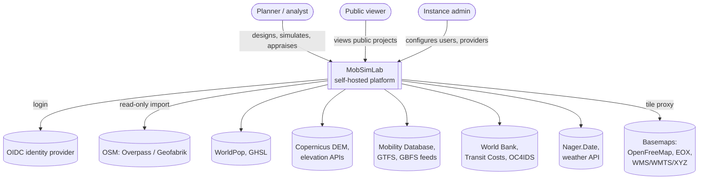
```mermaid
flowchart TB
  planner([Planner / analyst])
  viewer([Public viewer])
  admin([Instance admin])
  MSL[["MobSimLab<br/>self-hosted platform"]]
  IDP[(OIDC identity provider)]
  OSM[(OSM: Overpass / Geofabrik)]
  POP[(WorldPop, GHSL)]
  DEM[(Copernicus DEM,<br/>elevation APIs)]
  FEEDS[(Mobility Database,<br/>GTFS, GBFS feeds)]
  ECON[(World Bank,<br/>Transit Costs, OC4IDS)]
  CAL[(Nager.Date,<br/>weather API)]
  TILES[(Basemaps:<br/>OpenFreeMap, EOX,<br/>WMS/WMTS/XYZ)]

  planner -- designs, simulates, appraises --> MSL
  viewer -- views public projects --> MSL
  admin -- configures users, providers --> MSL
  MSL -- login --> IDP
  MSL -- read-only import --> OSM
  MSL --> POP
  MSL --> DEM
  MSL --> FEEDS
  MSL --> ECON
  MSL --> CAL
  MSL -- tile proxy --> TILES
```

---

## 2. UML class diagrams

### 2.1 Core and provenance

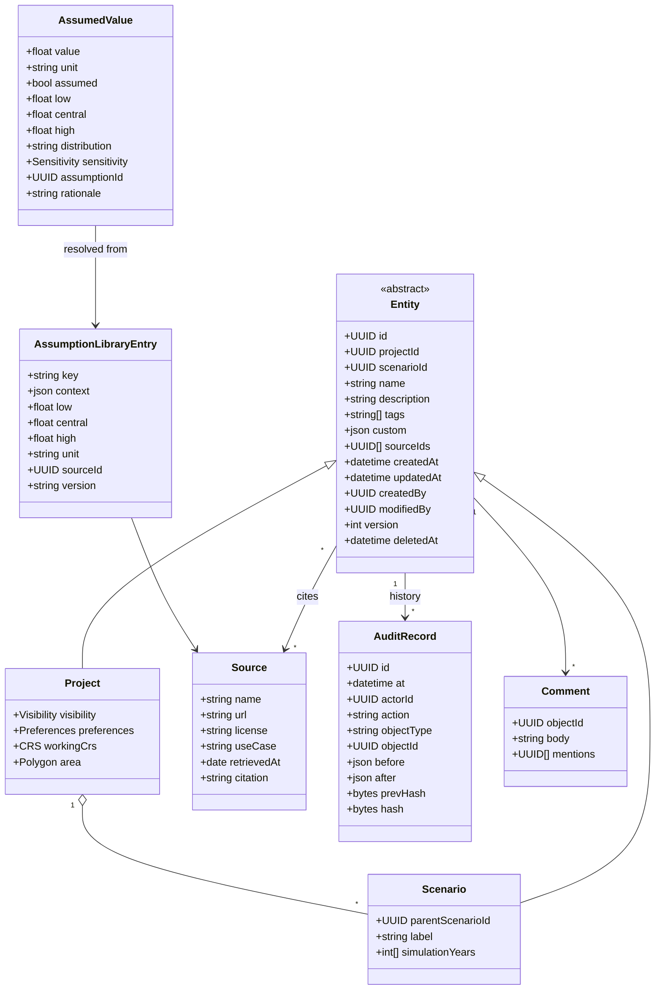
```mermaid
classDiagram
  class Entity {
    <<abstract>>
    +UUID id
    +UUID projectId
    +UUID scenarioId
    +string name
    +string description
    +string[] tags
    +json custom
    +UUID[] sourceIds
    +datetime createdAt
    +datetime updatedAt
    +UUID createdBy
    +UUID modifiedBy
    +int version
    +datetime deletedAt
  }
  class Project {
    +Visibility visibility
    +Preferences preferences
    +CRS workingCrs
    +Polygon area
  }
  class Scenario {
    +UUID parentScenarioId
    +string label
    +int[] simulationYears
  }
  class Source {
    +string name
    +string url
    +string license
    +string useCase
    +date retrievedAt
    +string citation
  }
  class AssumedValue {
    +float value
    +string unit
    +bool assumed
    +float low
    +float central
    +float high
    +string distribution
    +Sensitivity sensitivity
    +UUID assumptionId
    +string rationale
  }
  class AssumptionLibraryEntry {
    +string key
    +json context
    +float low
    +float central
    +float high
    +string unit
    +UUID sourceId
    +string version
  }
  class AuditRecord {
    +UUID id
    +datetime at
    +UUID actorId
    +string action
    +string objectType
    +UUID objectId
    +json before
    +json after
    +bytes prevHash
    +bytes hash
  }
  class Comment {
    +UUID objectId
    +string body
    +UUID[] mentions
  }
  Entity <|-- Project
  Entity <|-- Scenario
  Project "1" o-- "*" Scenario
  Entity "*" --> "*" Source : cites
  Entity "1" --> "*" AuditRecord : history
  Entity "1" --> "*" Comment
  AssumedValue --> AssumptionLibraryEntry : resolved from
  AssumptionLibraryEntry --> Source
```

### 2.2 Network, stations, service

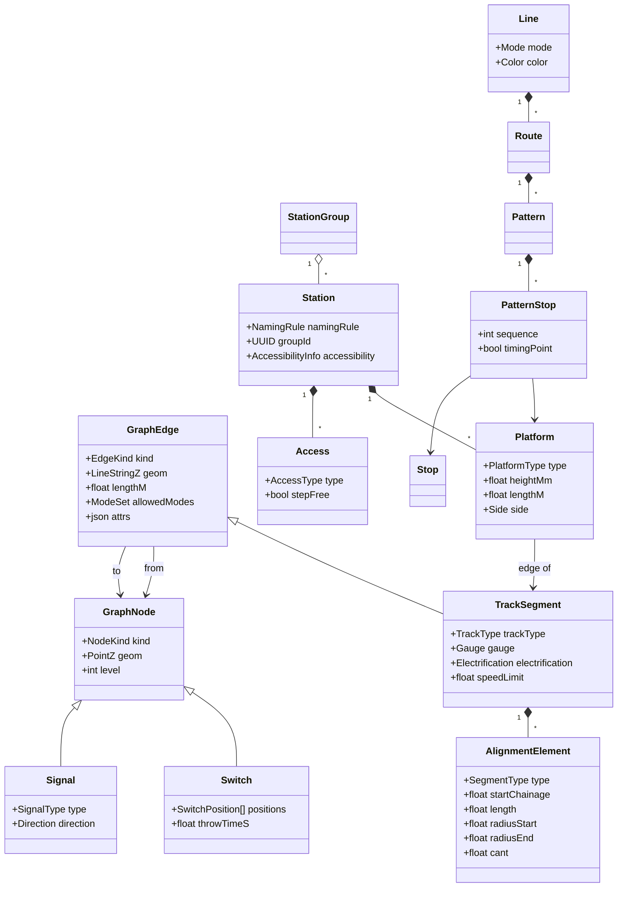
```mermaid
classDiagram
  class GraphNode {
    +NodeKind kind
    +PointZ geom
    +int level
  }
  class GraphEdge {
    +EdgeKind kind
    +LineStringZ geom
    +float lengthM
    +ModeSet allowedModes
    +json attrs
  }
  class TrackSegment {
    +TrackType trackType
    +Gauge gauge
    +Electrification electrification
    +float speedLimit
  }
  class AlignmentElement {
    +SegmentType type
    +float startChainage
    +float length
    +float radiusStart
    +float radiusEnd
    +float cant
  }
  class Switch {
    +SwitchPosition[] positions
    +float throwTimeS
  }
  class Signal {
    +SignalType type
    +Direction direction
  }
  class Station {
    +NamingRule namingRule
    +UUID groupId
    +AccessibilityInfo accessibility
  }
  class StationGroup
  class Platform {
    +PlatformType type
    +float heightMm
    +float lengthM
    +Side side
  }
  class Stop
  class Access {
    +AccessType type
    +bool stepFree
  }
  class Line {
    +Mode mode
    +Color color
  }
  class Route
  class Pattern
  class PatternStop {
    +int sequence
    +bool timingPoint
  }
  GraphNode <|-- Switch
  GraphNode <|-- Signal
  GraphEdge <|-- TrackSegment
  TrackSegment "1" *-- "*" AlignmentElement
  GraphEdge --> GraphNode : from
  GraphEdge --> GraphNode : to
  StationGroup "1" o-- "*" Station
  Station "1" *-- "*" Platform
  Station "1" *-- "*" Access
  Platform --> TrackSegment : edge of
  Line "1" *-- "*" Route
  Route "1" *-- "*" Pattern
  Pattern "1" *-- "*" PatternStop
  PatternStop --> Platform
  PatternStop --> Stop
```

### 2.3 Fleet, timetable, simulation

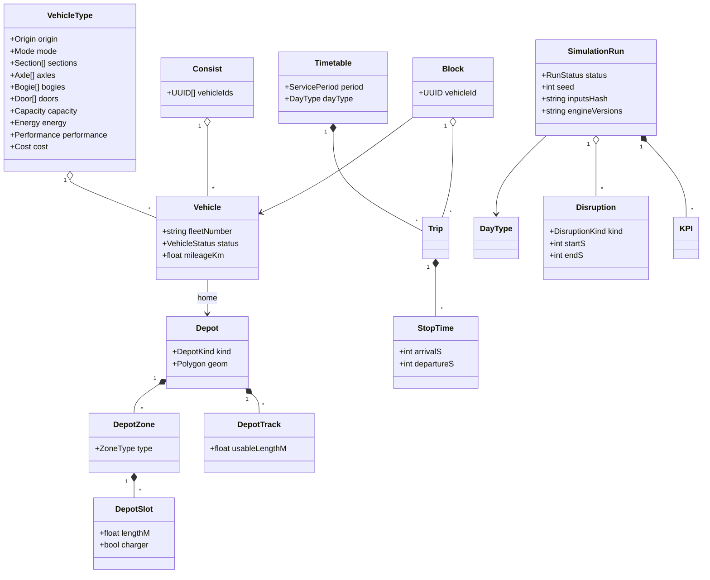
```mermaid
classDiagram
  class VehicleType {
    +Origin origin
    +Mode mode
    +Section[] sections
    +Axle[] axles
    +Bogie[] bogies
    +Door[] doors
    +Capacity capacity
    +Energy energy
    +Performance performance
    +Cost cost
  }
  class Vehicle {
    +string fleetNumber
    +VehicleStatus status
    +float mileageKm
  }
  class Consist {
    +UUID[] vehicleIds
  }
  class Depot {
    +DepotKind kind
    +Polygon geom
  }
  class DepotZone {
    +ZoneType type
  }
  class DepotSlot {
    +float lengthM
    +bool charger
  }
  class DepotTrack {
    +float usableLengthM
  }
  class Timetable {
    +ServicePeriod period
    +DayType dayType
  }
  class Trip
  class StopTime {
    +int arrivalS
    +int departureS
  }
  class Block {
    +UUID vehicleId
  }
  class SimulationRun {
    +RunStatus status
    +int seed
    +string inputsHash
    +string engineVersions
  }
  class DayType
  class Disruption {
    +DisruptionKind kind
    +int startS
    +int endS
  }
  class KPI
  VehicleType "1" o-- "*" Vehicle
  Vehicle --> Depot : home
  Depot "1" *-- "*" DepotZone
  DepotZone "1" *-- "*" DepotSlot
  Depot "1" *-- "*" DepotTrack
  Consist "1" o-- "*" Vehicle
  Timetable "1" *-- "*" Trip
  Trip "1" *-- "*" StopTime
  Block "1" o-- "*" Trip
  Block --> Vehicle
  SimulationRun --> DayType
  SimulationRun "1" o-- "*" Disruption
  SimulationRun "1" *-- "*" KPI
```

### 2.4 Rail kernel internal model (Rust)

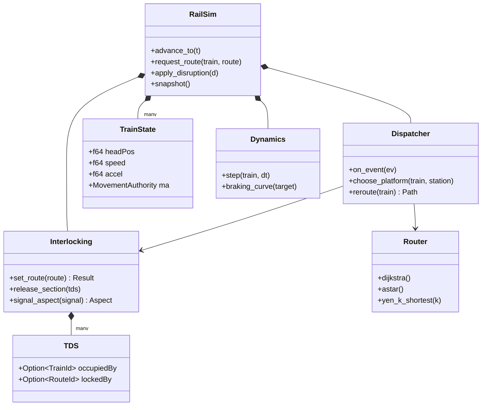
```mermaid
classDiagram
  class RailSim {
    +advance_to(t)
    +request_route(train, route)
    +apply_disruption(d)
    +snapshot()
  }
  class Interlocking {
    +set_route(route) Result
    +release_section(tds)
    +signal_aspect(signal) Aspect
  }
  class Dispatcher {
    +on_event(ev)
    +choose_platform(train, station)
    +reroute(train) Path
  }
  class TrainState {
    +f64 headPos
    +f64 speed
    +f64 accel
    +MovementAuthority ma
  }
  class Dynamics {
    +step(train, dt)
    +braking_curve(target)
  }
  class TDS {
    +Option~TrainId~ occupiedBy
    +Option~RouteId~ lockedBy
  }
  class Router {
    +dijkstra()
    +astar()
    +yen_k_shortest(k)
  }
  RailSim *-- Interlocking
  RailSim *-- Dispatcher
  RailSim *-- "many" TrainState
  RailSim *-- Dynamics
  Interlocking *-- "many" TDS
  Dispatcher --> Interlocking
  Dispatcher --> Router
```

---

## 3. Entity relationship diagrams

### 3.1 Identity, projects, provenance, audit

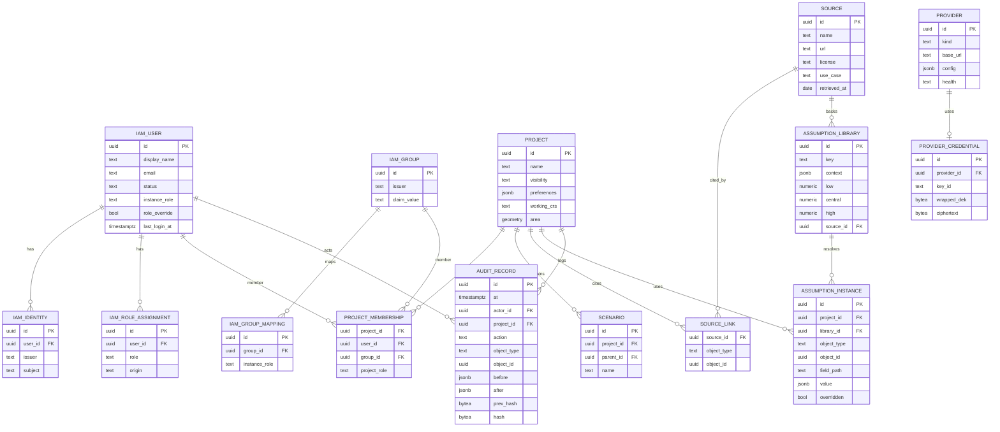
```mermaid
erDiagram
  IAM_USER ||--o{ IAM_IDENTITY : has
  IAM_USER ||--o{ IAM_ROLE_ASSIGNMENT : has
  IAM_GROUP ||--o{ IAM_GROUP_MAPPING : maps
  IAM_USER ||--o{ PROJECT_MEMBERSHIP : member
  IAM_GROUP ||--o{ PROJECT_MEMBERSHIP : member
  PROJECT ||--o{ PROJECT_MEMBERSHIP : grants
  PROJECT ||--o{ SCENARIO : contains
  PROJECT ||--o{ SOURCE_LINK : cites
  SOURCE ||--o{ SOURCE_LINK : cited_by
  PROJECT ||--o{ ASSUMPTION_INSTANCE : uses
  ASSUMPTION_LIBRARY ||--o{ ASSUMPTION_INSTANCE : resolves
  SOURCE ||--o{ ASSUMPTION_LIBRARY : backs
  PROJECT ||--o{ AUDIT_RECORD : logs
  IAM_USER ||--o{ AUDIT_RECORD : acts
  PROVIDER ||--o| PROVIDER_CREDENTIAL : uses

  IAM_USER {
    uuid id PK
    text display_name
    text email
    text status
    text instance_role
    bool role_override
    timestamptz last_login_at
  }
  IAM_IDENTITY {
    uuid id PK
    uuid user_id FK
    text issuer
    text subject
  }
  IAM_ROLE_ASSIGNMENT {
    uuid id PK
    uuid user_id FK
    text role
    text origin
  }
  IAM_GROUP {
    uuid id PK
    text issuer
    text claim_value
  }
  IAM_GROUP_MAPPING {
    uuid id PK
    uuid group_id FK
    text instance_role
  }
  PROJECT {
    uuid id PK
    text name
    text visibility
    jsonb preferences
    text working_crs
    geometry area
  }
  PROJECT_MEMBERSHIP {
    uuid project_id FK
    uuid user_id FK
    uuid group_id FK
    text project_role
  }
  SCENARIO {
    uuid id PK
    uuid project_id FK
    uuid parent_id FK
    text name
  }
  SOURCE {
    uuid id PK
    text name
    text url
    text license
    text use_case
    date retrieved_at
  }
  SOURCE_LINK {
    uuid source_id FK
    text object_type
    uuid object_id
  }
  ASSUMPTION_LIBRARY {
    uuid id PK
    text key
    jsonb context
    numeric low
    numeric central
    numeric high
    uuid source_id FK
  }
  ASSUMPTION_INSTANCE {
    uuid id PK
    uuid project_id FK
    uuid library_id FK
    text object_type
    uuid object_id
    text field_path
    jsonb value
    bool overridden
  }
  AUDIT_RECORD {
    uuid id PK
    timestamptz at
    uuid actor_id FK
    uuid project_id FK
    text action
    text object_type
    uuid object_id
    jsonb before
    jsonb after
    bytea prev_hash
    bytea hash
  }
  PROVIDER {
    uuid id PK
    text kind
    text base_url
    jsonb config
    text health
  }
  PROVIDER_CREDENTIAL {
    uuid id PK
    uuid provider_id FK
    text key_id
    bytea wrapped_dek
    bytea ciphertext
  }
```

### 3.2 Network, stations, service, fleet

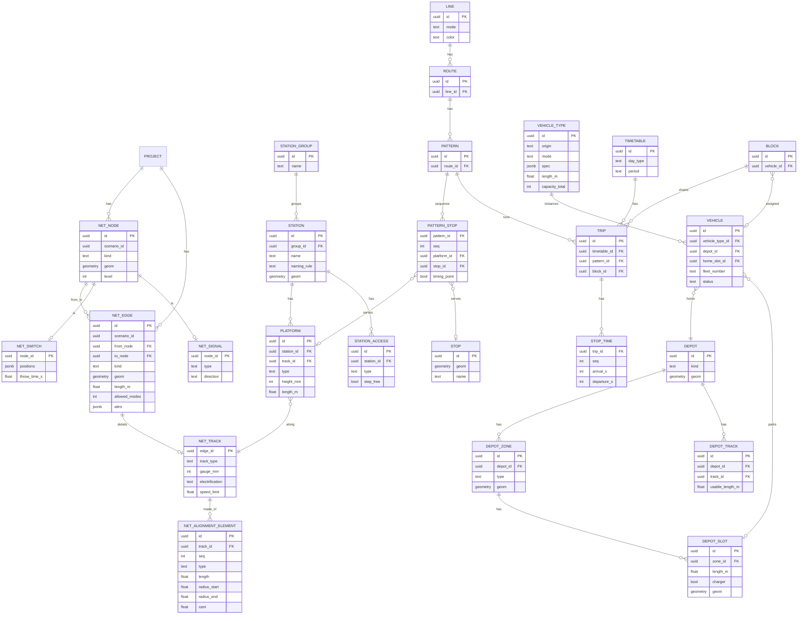
```mermaid
erDiagram
  PROJECT ||--o{ NET_NODE : has
  PROJECT ||--o{ NET_EDGE : has
  NET_NODE ||--o{ NET_EDGE : from_to
  NET_EDGE ||--o| NET_TRACK : details
  NET_TRACK ||--o{ NET_ALIGNMENT_ELEMENT : made_of
  NET_NODE ||--o| NET_SWITCH : is
  NET_NODE ||--o| NET_SIGNAL : is
  STATION_GROUP ||--o{ STATION : groups
  STATION ||--o{ PLATFORM : has
  STATION ||--o{ STATION_ACCESS : has
  PLATFORM }o--|| NET_TRACK : along
  LINE ||--o{ ROUTE : has
  ROUTE ||--o{ PATTERN : has
  PATTERN ||--o{ PATTERN_STOP : sequence
  PATTERN_STOP }o--o| PLATFORM : serves
  PATTERN_STOP }o--o| STOP : serves
  VEHICLE_TYPE ||--o{ VEHICLE : instances
  DEPOT ||--o{ DEPOT_ZONE : has
  DEPOT_ZONE ||--o{ DEPOT_SLOT : has
  DEPOT ||--o{ DEPOT_TRACK : has
  VEHICLE }o--|| DEPOT : home
  VEHICLE }o--o| DEPOT_SLOT : parks
  TIMETABLE ||--o{ TRIP : has
  PATTERN ||--o{ TRIP : runs
  TRIP ||--o{ STOP_TIME : has
  BLOCK ||--o{ TRIP : chains
  BLOCK }o--o| VEHICLE : assigned

  NET_NODE {
    uuid id PK
    uuid scenario_id
    text kind
    geometry geom
    int level
  }
  NET_EDGE {
    uuid id PK
    uuid scenario_id
    uuid from_node FK
    uuid to_node FK
    text kind
    geometry geom
    float length_m
    int allowed_modes
    jsonb attrs
  }
  NET_TRACK {
    uuid edge_id PK
    text track_type
    int gauge_mm
    text electrification
    float speed_limit
  }
  NET_ALIGNMENT_ELEMENT {
    uuid id PK
    uuid track_id FK
    int seq
    text type
    float length
    float radius_start
    float radius_end
    float cant
  }
  NET_SWITCH {
    uuid node_id PK
    jsonb positions
    float throw_time_s
  }
  NET_SIGNAL {
    uuid node_id PK
    text type
    text direction
  }
  STATION_GROUP {
    uuid id PK
    text name
  }
  STATION {
    uuid id PK
    uuid group_id FK
    text name
    text naming_rule
    geometry geom
  }
  PLATFORM {
    uuid id PK
    uuid station_id FK
    uuid track_id FK
    text type
    int height_mm
    float length_m
  }
  STATION_ACCESS {
    uuid id PK
    uuid station_id FK
    text type
    bool step_free
  }
  STOP {
    uuid id PK
    geometry geom
    text name
  }
  LINE {
    uuid id PK
    text mode
    text color
  }
  ROUTE {
    uuid id PK
    uuid line_id FK
  }
  PATTERN {
    uuid id PK
    uuid route_id FK
  }
  PATTERN_STOP {
    uuid pattern_id FK
    int seq
    uuid platform_id FK
    uuid stop_id FK
    bool timing_point
  }
  VEHICLE_TYPE {
    uuid id PK
    text origin
    text mode
    jsonb spec
    float length_m
    int capacity_total
  }
  VEHICLE {
    uuid id PK
    uuid vehicle_type_id FK
    uuid depot_id FK
    uuid home_slot_id FK
    text fleet_number
    text status
  }
  DEPOT {
    uuid id PK
    text kind
    geometry geom
  }
  DEPOT_ZONE {
    uuid id PK
    uuid depot_id FK
    text type
    geometry geom
  }
  DEPOT_SLOT {
    uuid id PK
    uuid zone_id FK
    float length_m
    bool charger
    geometry geom
  }
  DEPOT_TRACK {
    uuid id PK
    uuid depot_id FK
    uuid track_id FK
    float usable_length_m
  }
  TIMETABLE {
    uuid id PK
    text day_type
    text period
  }
  TRIP {
    uuid id PK
    uuid timetable_id FK
    uuid pattern_id FK
    uuid block_id FK
  }
  STOP_TIME {
    uuid trip_id FK
    int seq
    int arrival_s
    int departure_s
  }
  BLOCK {
    uuid id PK
    uuid vehicle_id FK
  }
```

### 3.3 Simulation, demand, cost

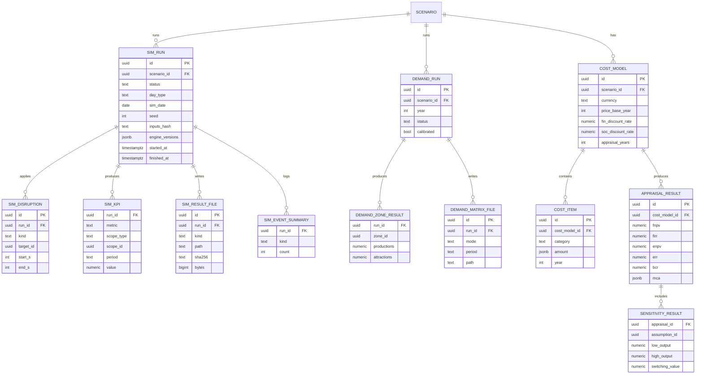
```mermaid
erDiagram
  SCENARIO ||--o{ SIM_RUN : runs
  SIM_RUN ||--o{ SIM_DISRUPTION : applies
  SIM_RUN ||--o{ SIM_KPI : produces
  SIM_RUN ||--o{ SIM_RESULT_FILE : writes
  SIM_RUN ||--o{ SIM_EVENT_SUMMARY : logs
  SCENARIO ||--o{ DEMAND_RUN : runs
  DEMAND_RUN ||--o{ DEMAND_ZONE_RESULT : produces
  DEMAND_RUN ||--o{ DEMAND_MATRIX_FILE : writes
  SCENARIO ||--o{ COST_MODEL : has
  COST_MODEL ||--o{ COST_ITEM : contains
  COST_MODEL ||--o{ APPRAISAL_RESULT : produces
  APPRAISAL_RESULT ||--o{ SENSITIVITY_RESULT : includes

  SIM_RUN {
    uuid id PK
    uuid scenario_id FK
    text status
    text day_type
    date sim_date
    int seed
    text inputs_hash
    jsonb engine_versions
    timestamptz started_at
    timestamptz finished_at
  }
  SIM_DISRUPTION {
    uuid id PK
    uuid run_id FK
    text kind
    uuid target_id
    int start_s
    int end_s
  }
  SIM_KPI {
    uuid run_id FK
    text metric
    text scope_type
    uuid scope_id
    text period
    numeric value
  }
  SIM_RESULT_FILE {
    uuid id PK
    uuid run_id FK
    text kind
    text path
    text sha256
    bigint bytes
  }
  SIM_EVENT_SUMMARY {
    uuid run_id FK
    text kind
    int count
  }
  DEMAND_RUN {
    uuid id PK
    uuid scenario_id FK
    int year
    text status
    bool calibrated
  }
  DEMAND_ZONE_RESULT {
    uuid run_id FK
    uuid zone_id
    numeric productions
    numeric attractions
  }
  DEMAND_MATRIX_FILE {
    uuid id PK
    uuid run_id FK
    text mode
    text period
    text path
  }
  COST_MODEL {
    uuid id PK
    uuid scenario_id FK
    text currency
    int price_base_year
    numeric fin_discount_rate
    numeric soc_discount_rate
    int appraisal_years
  }
  COST_ITEM {
    uuid id PK
    uuid cost_model_id FK
    text category
    jsonb amount
    int year
  }
  APPRAISAL_RESULT {
    uuid id PK
    uuid cost_model_id FK
    numeric fnpv
    numeric firr
    numeric enpv
    numeric err
    numeric bcr
    jsonb mca
  }
  SENSITIVITY_RESULT {
    uuid appraisal_id FK
    uuid assumption_id
    numeric low_output
    numeric high_output
    numeric switching_value
  }
```

---

## 4. Event flow diagrams

Domain events are published in-process (NestJS event emitter) after commit (transactional outbox table → pg-boss for cross-process consumers).

### 4.1 Editing → validation → derived data

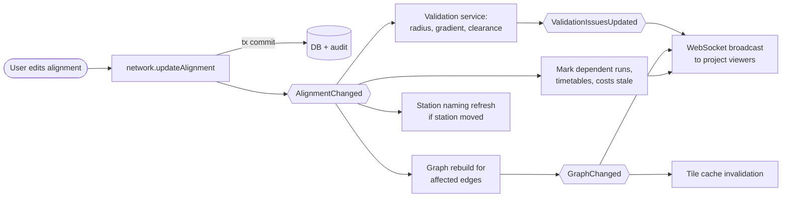
```mermaid
flowchart LR
  E1([User edits alignment]) --> C1[network.updateAlignment]
  C1 -->|tx commit| DB[(DB + audit)]
  C1 --> EV1{{AlignmentChanged}}
  EV1 --> V1[Validation service:<br/>radius, gradient, clearance]
  EV1 --> G1[Graph rebuild for<br/>affected edges]
  EV1 --> N1[Station naming refresh<br/>if station moved]
  EV1 --> S1[Mark dependent runs,<br/>timetables, costs stale]
  V1 --> EV2{{ValidationIssuesUpdated}}
  G1 --> EV3{{GraphChanged}}
  EV3 --> T1[Tile cache invalidation]
  EV2 --> WS[WebSocket broadcast<br/>to project viewers]
  EV3 --> WS
  S1 --> WS
```

### 4.2 Simulation run events

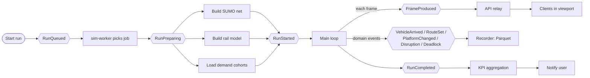
```mermaid
flowchart LR
  R0([Start run]) --> Q{{RunQueued}}
  Q --> W[sim-worker picks job]
  W --> P{{RunPreparing}}
  P --> B1[Build SUMO net]
  P --> B2[Build rail model]
  P --> B3[Load demand cohorts]
  B1 & B2 & B3 --> RN{{RunStarted}}
  RN --> L[Main loop]
  L -->|each frame| FR{{FrameProduced}} --> API[API relay] --> UI[Clients in viewport]
  L -->|domain events| DE{{VehicleArrived / RouteSet /<br/>PlatformChanged / Disruption / Deadlock}}
  DE --> REC[Recorder: Parquet]
  L --> DONE{{RunCompleted}}
  DONE --> K[KPI aggregation]
  K --> N[Notify user]
```

### 4.3 External provider events

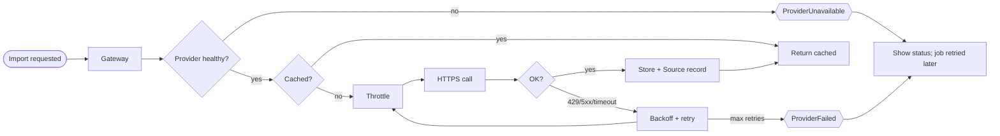
```mermaid
flowchart LR
  REQ([Import requested]) --> GW[Gateway]
  GW --> HC{Provider healthy?}
  HC -- no --> PE{{ProviderUnavailable}} --> UI[Show status; job retried later]
  HC -- yes --> CA{Cached?}
  CA -- yes --> RES[Return cached]
  CA -- no --> TH[Throttle] --> HTTP[HTTPS call] --> OK{OK?}
  OK -- 429/5xx/timeout --> BO[Backoff + retry] --> TH
  OK -- yes --> ST[Store + Source record] --> RES
  BO -- max retries --> PF{{ProviderFailed}} --> UI
```

---

## 5. Sequence diagrams

### 5.1 First login, Owner setup mode

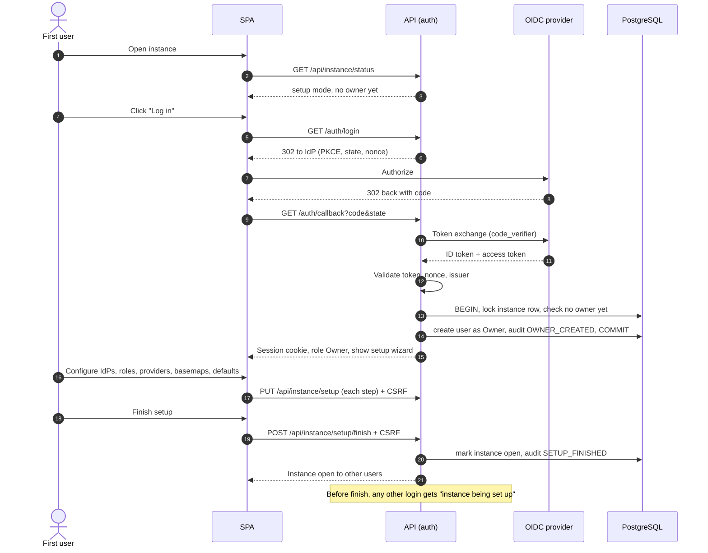
```mermaid
sequenceDiagram
  autonumber
  actor A as First user
  participant UI as SPA
  participant API as API (auth)
  participant IDP as OIDC provider
  participant DB as PostgreSQL
  A->>UI: Open instance
  UI->>API: GET /api/instance/status
  API-->>UI: setup mode, no owner yet
  A->>UI: Click "Log in"
  UI->>API: GET /auth/login
  API-->>UI: 302 to IdP (PKCE, state, nonce)
  UI->>IDP: Authorize
  IDP-->>UI: 302 back with code
  UI->>API: GET /auth/callback?code&state
  API->>IDP: Token exchange (code_verifier)
  IDP-->>API: ID token + access token
  API->>API: Validate token, nonce, issuer
  API->>DB: BEGIN, lock instance row, check no owner yet
  API->>DB: create user as Owner, audit OWNER_CREATED, COMMIT
  API-->>UI: Session cookie, role Owner, show setup wizard
  A->>UI: Configure IdPs, roles, providers, basemaps, defaults
  UI->>API: PUT /api/instance/setup (each step) + CSRF
  A->>UI: Finish setup
  UI->>API: POST /api/instance/setup/finish + CSRF
  API->>DB: mark instance open, audit SETUP_FINISHED
  API-->>UI: Instance open to other users
  Note over API: Before finish, any other login gets "instance being set up"
```

### 5.2 OSM import

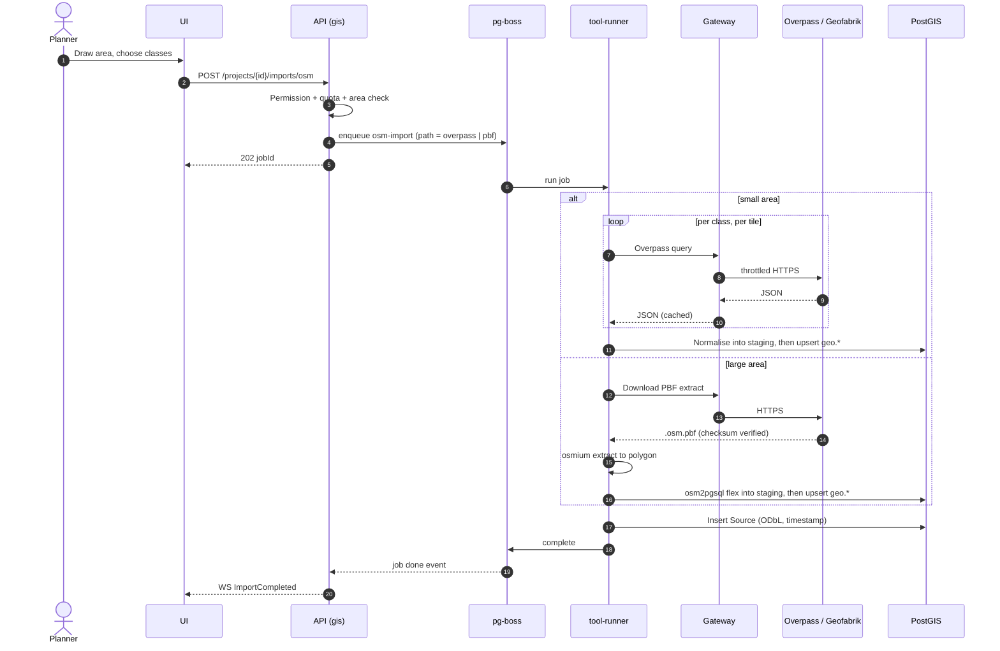
```mermaid
sequenceDiagram
  autonumber
  actor U as Planner
  participant UI
  participant API as API (gis)
  participant Q as pg-boss
  participant TR as tool-runner
  participant GW as Gateway
  participant OP as Overpass / Geofabrik
  participant DB as PostGIS
  U->>UI: Draw area, choose classes
  UI->>API: POST /projects/{id}/imports/osm
  API->>API: Permission + quota + area check
  API->>Q: enqueue osm-import (path = overpass | pbf)
  API-->>UI: 202 jobId
  Q->>TR: run job
  alt small area
    loop per class, per tile
      TR->>GW: Overpass query
      GW->>OP: throttled HTTPS
      OP-->>GW: JSON
      GW-->>TR: JSON (cached)
    end
    TR->>DB: Normalise into staging, then upsert geo.*
  else large area
    TR->>GW: Download PBF extract
    GW->>OP: HTTPS
    OP-->>TR: .osm.pbf (checksum verified)
    TR->>TR: osmium extract to polygon
    TR->>DB: osm2pgsql flex into staging, then upsert geo.*
  end
  TR->>DB: Insert Source (ODbL, timestamp)
  TR->>Q: complete
  Q-->>API: job done event
  API-->>UI: WS ImportCompleted
```

### 5.3 Simulation run with co-simulation step

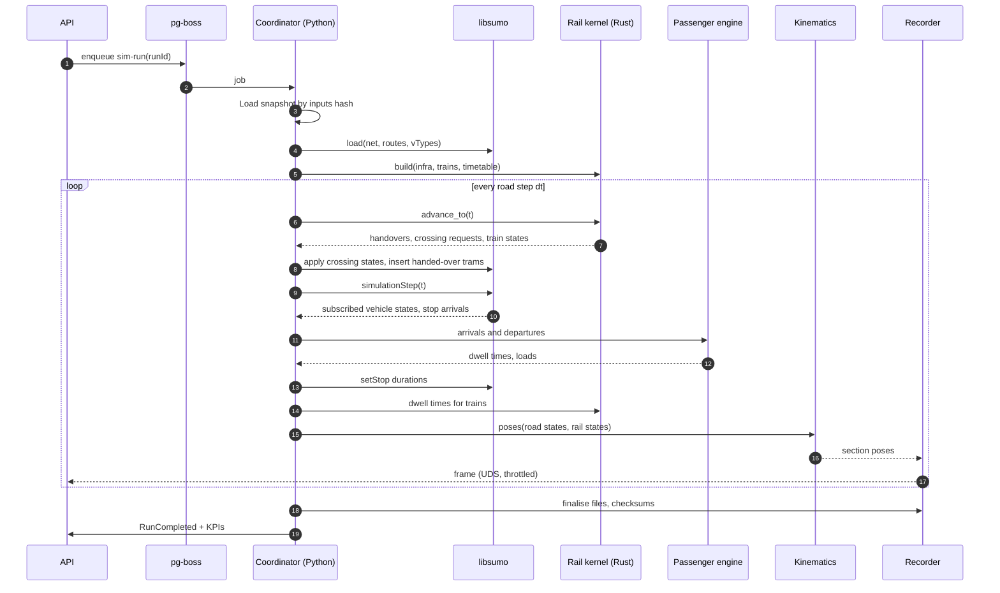
```mermaid
sequenceDiagram
  autonumber
  participant API
  participant Q as pg-boss
  participant CO as Coordinator (Python)
  participant SUMO as libsumo
  participant RK as Rail kernel (Rust)
  participant PX as Passenger engine
  participant KIN as Kinematics
  participant REC as Recorder
  API->>Q: enqueue sim-run(runId)
  Q->>CO: job
  CO->>CO: Load snapshot by inputs hash
  CO->>SUMO: load(net, routes, vTypes)
  CO->>RK: build(infra, trains, timetable)
  loop every road step dt
    CO->>RK: advance_to(t)
    RK-->>CO: handovers, crossing requests, train states
    CO->>SUMO: apply crossing states, insert handed-over trams
    CO->>SUMO: simulationStep(t)
    SUMO-->>CO: subscribed vehicle states, stop arrivals
    CO->>PX: arrivals and departures
    PX-->>CO: dwell times, loads
    CO->>SUMO: setStop durations
    CO->>RK: dwell times for trains
    CO->>KIN: poses(road states, rail states)
    KIN-->>REC: section poses
    REC-->>API: frame (UDS, throttled)
  end
  CO->>REC: finalise files, checksums
  CO->>API: RunCompleted + KPIs
```

### 5.4 Rail route setting

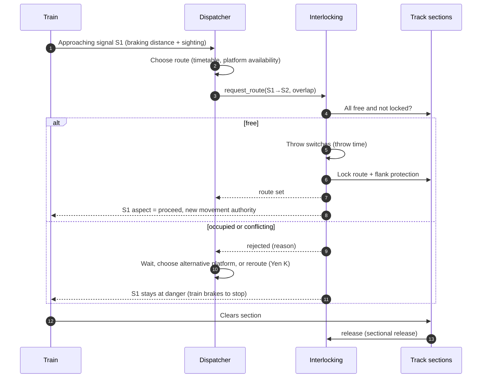
```mermaid
sequenceDiagram
  autonumber
  participant T as Train
  participant D as Dispatcher
  participant I as Interlocking
  participant TDS as Track sections
  T->>D: Approaching signal S1 (braking distance + sighting)
  D->>D: Choose route (timetable, platform availability)
  D->>I: request_route(S1→S2, overlap)
  I->>TDS: All free and not locked?
  alt free
    I->>I: Throw switches (throw time)
    I->>TDS: Lock route + flank protection
    I-->>D: route set
    I-->>T: S1 aspect = proceed, new movement authority
  else occupied or conflicting
    I-->>D: rejected (reason)
    D->>D: Wait, choose alternative platform, or reroute (Yen K)
    I-->>T: S1 stays at danger (train brakes to stop)
  end
  T->>TDS: Clears section
  TDS->>I: release (sectional release)
```

### 5.5 Timetable generation

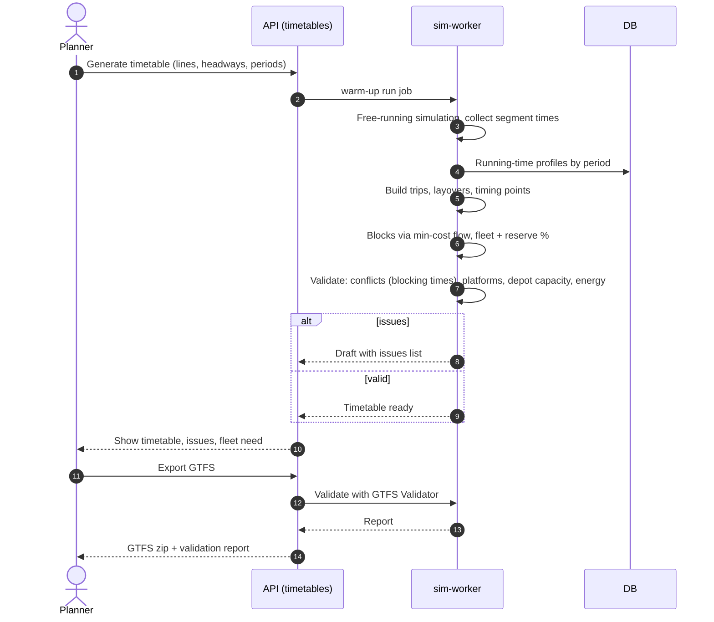
```mermaid
sequenceDiagram
  autonumber
  actor U as Planner
  participant API as API (timetables)
  participant W as sim-worker
  participant DB
  U->>API: Generate timetable (lines, headways, periods)
  API->>W: warm-up run job
  W->>W: Free-running simulation, collect segment times
  W->>DB: Running-time profiles by period
  W->>W: Build trips, layovers, timing points
  W->>W: Blocks via min-cost flow, fleet + reserve %
  W->>W: Validate: conflicts (blocking times), platforms, depot capacity, energy
  alt issues
    W-->>API: Draft with issues list
  else valid
    W-->>API: Timetable ready
  end
  API-->>U: Show timetable, issues, fleet need
  U->>API: Export GTFS
  API->>W: Validate with GTFS Validator
  W-->>API: Report
  API-->>U: GTFS zip + validation report
```

### 5.6 Demand model run

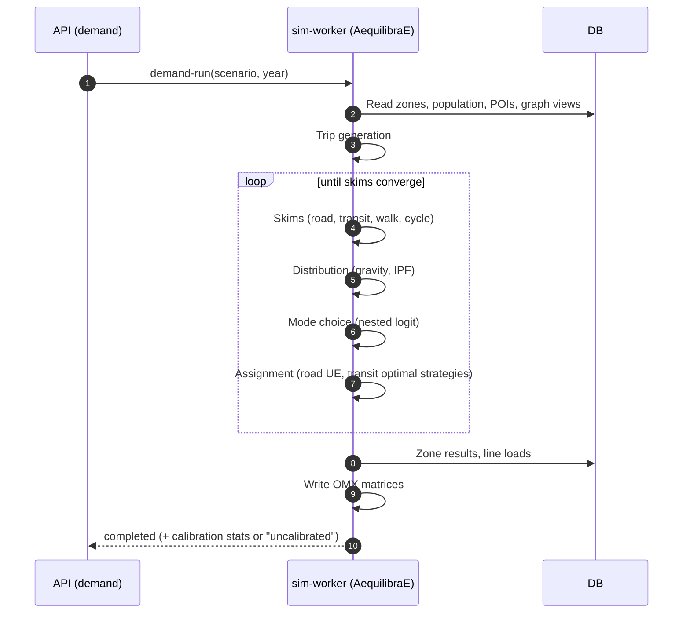
```mermaid
sequenceDiagram
  autonumber
  participant API as API (demand)
  participant W as sim-worker (AequilibraE)
  participant DB
  API->>W: demand-run(scenario, year)
  W->>DB: Read zones, population, POIs, graph views
  W->>W: Trip generation
  loop until skims converge
    W->>W: Skims (road, transit, walk, cycle)
    W->>W: Distribution (gravity, IPF)
    W->>W: Mode choice (nested logit)
    W->>W: Assignment (road UE, transit optimal strategies)
  end
  W->>DB: Zone results, line loads
  W->>W: Write OMX matrices
  W-->>API: completed (+ calibration stats or "uncalibrated")
```

### 5.7 Protected basemap tile via proxy

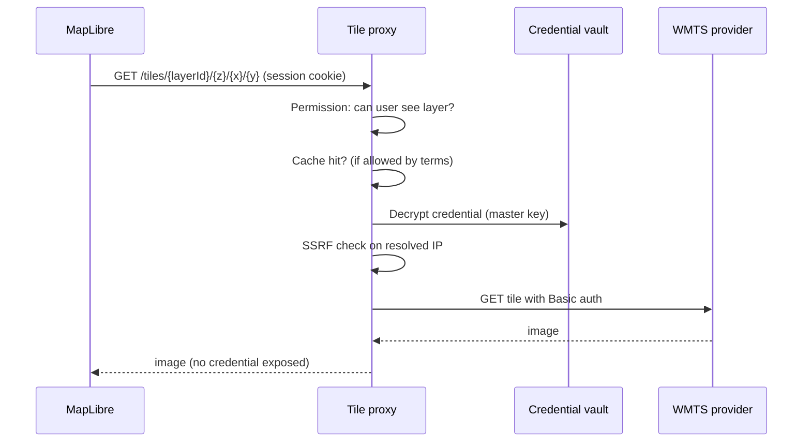
```mermaid
sequenceDiagram
  participant UI as MapLibre
  participant API as Tile proxy
  participant V as Credential vault
  participant P as WMTS provider
  UI->>API: GET /tiles/{layerId}/{z}/{x}/{y} (session cookie)
  API->>API: Permission: can user see layer?
  API->>API: Cache hit? (if allowed by terms)
  API->>V: Decrypt credential (master key)
  API->>API: SSRF check on resolved IP
  API->>P: GET tile with Basic auth
  P-->>API: image
  API-->>UI: image (no credential exposed)
```

---

## 6. Service interaction diagram

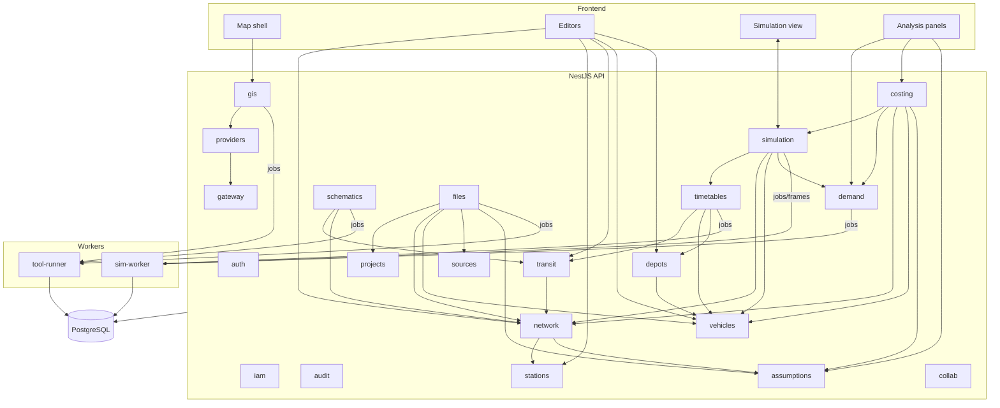
```mermaid
flowchart TB
  subgraph Frontend
    MAP[Map shell]
    ED[Editors]
    SV[Simulation view]
    AN[Analysis panels]
  end
  subgraph API[NestJS API]
    AUTH[auth]
    IAM[iam]
    AUD[audit]
    PRJ[projects]
    SRC[sources]
    ASM[assumptions]
    PRV[providers]
    GW[gateway]
    GIS[gis]
    NET[network]
    STN[stations]
    TRN[transit]
    VEH[vehicles]
    DEP[depots]
    TT[timetables]
    SIM[simulation]
    DEM[demand]
    CST[costing]
    SCH[schematics]
    FIL[files]
    COL[collab]
  end
  subgraph Workers
    WK[sim-worker]
    TRN2[tool-runner]
  end
  DB[(PostgreSQL)]

  MAP --> GIS
  ED --> NET & STN & TRN & VEH & DEP
  SV <--> SIM
  AN --> DEM & CST & ASM
  NET --> STN
  NET --> ASM
  TRN --> NET
  DEP --> VEH
  TT --> TRN & VEH & DEP
  SIM --> TT & NET & VEH & DEM
  CST --> SIM & DEM & NET & VEH & ASM
  SCH --> TRN & NET
  GIS --> PRV --> GW
  FIL --> PRJ & NET & VEH & SRC & ASM
  SIM -- jobs/frames --> WK
  DEM -- jobs --> WK
  TT -- jobs --> WK
  GIS -- jobs --> TRN2
  SCH -- jobs --> TRN2
  FIL -- jobs --> TRN2
  WK --> DB
  TRN2 --> DB
  API --> DB
```

Every API module also depends on `iam` (permission checks), `audit` (via DB triggers and explicit audit events) and `core`; those edges are omitted for readability.

---

## 7. State diagrams

### 7.1 Persistent transit vehicle (asset lifecycle)

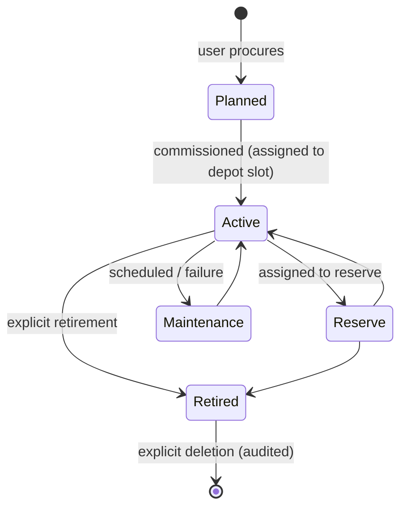
```mermaid
stateDiagram-v2
  [*] --> Planned: user procures
  Planned --> Active: commissioned (assigned to depot slot)
  Active --> Reserve: assigned to reserve
  Reserve --> Active
  Active --> Maintenance: scheduled / failure
  Maintenance --> Active
  Active --> Retired: explicit retirement
  Reserve --> Retired
  Retired --> [*]: explicit deletion (audited)
```

### 7.2 Vehicle during a run (operational state)

```mermaid
stateDiagram-v2
  [*] --> Stabled: at depot slot/track at run start
  Stabled --> PullOut: block start
  PullOut --> InService: first trip departs
  InService --> Dwelling: arrives at stop
  Dwelling --> InService: departs
  InService --> Holding: early at timing point
  Holding --> InService
  InService --> WaitingSignal: red signal / queue
  WaitingSignal --> InService
  InService --> Deadhead: between trips
  Deadhead --> InService
  InService --> Failed: equipment failure
  Failed --> Recovery: rescue / tow
  Recovery --> Stabled
  Deadhead --> PullIn: block end
  PullIn --> Stabled
  Stabled --> [*]: run end (vehicle persists)
```

### 7.3 Rail route

```mermaid
stateDiagram-v2
  [*] --> Free
  Free --> Requested: dispatcher request
  Requested --> Setting: checks pass
  Requested --> Free: rejected
  Setting --> Locked: switches in position, locked
  Locked --> SignalCleared: signal proceed
  SignalCleared --> Occupied: train enters
  Occupied --> PartiallyReleased: sections cleared behind train
  PartiallyReleased --> Free: last section cleared
  Locked --> Free: cancelled (time release)
```

---

## 8. Component dependency map

Top-level deployable components and their compile/runtime dependencies.

```mermaid
flowchart LR
  subgraph shared[shared contracts]
    JS[JSON Schemas<br/>vehicle, project file, API DTO, frames]
  end
  FE[frontend SPA] --> JS
  API[api NestJS] --> JS
  PYW[sim-worker Python] --> JS
  RUST[rail + kinematics crates] --> JS
  PYW --> RUST
  PYW --> SUMO[Eclipse SUMO libsumo]
  PYW --> AEQ[AequilibraE]
  API --> PG[(PostgreSQL + PostGIS)]
  PYW --> PG
  TR[tool-runner scripts] --> OSM2[osm2pgsql, osmium]
  TR --> NC[SUMO netconvert]
  TR --> GTFSV[GTFS Validator JRE]
  TR --> LOOM[LOOM]
  TR --> GDAL[GDAL]
  API --> TR
  FE -. HTTP/WS .-> API
  VEH[vehicles/ catalogue] --> JS
  ASMLIB[assumptions/ library] --> API
  API --> VEH
```

Dependency rules (enforced in CI):

- `frontend` never imports from `api` source; only generated contract types.
- Rust crates do not depend on Python or Node.
- Only `api` talks to the internet (through `gateway`).

---

## 9. Module dependency maps

### 9.1 Backend modules (NestJS) — allowed dependencies

```mermaid
flowchart TB
  core
  logging --> core
  audit --> core
  iam --> core & audit
  auth --> iam & core & audit
  gateway --> core & logging
  providers --> gateway & core
  sources --> core
  assumptions --> sources & core
  projects --> iam & audit & core
  gis --> providers & projects & sources
  network --> gis & assumptions & projects
  stations --> network & gis
  vehicles --> assumptions & sources & projects
  depots --> network & vehicles
  transit --> network & stations
  timetables --> transit & vehicles & depots
  simulation --> timetables & network & vehicles & depots
  demand --> network & gis & transit & assumptions
  costing --> simulation & demand & network & vehicles & assumptions
  schematics --> transit & network & gis
  files --> projects & network & stations & transit & vehicles & sources & assumptions
  collab --> projects & iam
  admin --> iam & providers & projects
```

The graph must stay acyclic; `dependency-cruiser` enforces this rule set.

### 9.2 Frontend feature modules

```mermaid
flowchart TB
  shared_ui[shared/ui + map utils + api client]
  app[app shell] --> map & project_files & admin
  map --> shared_ui
  layers --> map
  network_editor --> map & layers
  stations --> network_editor
  vehicles --> shared_ui
  depots --> network_editor & vehicles
  timetable --> stations & vehicles
  simulation_view --> map & layers
  demand --> map
  costing --> shared_ui
  assumptions --> shared_ui
  sources --> shared_ui
  schematics --> shared_ui
  project_files --> shared_ui
  admin --> shared_ui
```

### 9.3 Worker packages and crates

```mermaid
flowchart LR
  jobs[mobsim_worker.jobs] --> road & rail & cosim & demand & timetable
  cosim --> road & rail & kinematics & results
  road --> sumo[libsumo]
  rail --> pyo3[mobsim-py] --> rail_sim
  kinematics --> pyo3
  pyo3 --> kin_crate[kinematics crate]
  rail_sim --> rail_dispatch --> rail_interlocking --> rail_model
  rail_sim --> rail_dynamics --> rail_model
  rail_dispatch --> pathfinding[pathfinding / petgraph]
  demand --> aeq[AequilibraE]
  timetable --> results
  results --> arrow[PyArrow]
```

---

## 10. Function dependency maps

Planned key functions on the critical paths. Names are indicative; generated maps will replace these after implementation.

### 10.1 Station naming

```mermaid
flowchart LR
  A["stations.service.createStation(dto)"] --> B["naming.resolveName(point, radii)"]
  B --> C["naming.findNearbyStation(point, r1)"]
  B --> D["naming.findNearbyStop(point, r2)"]
  B --> E["naming.findLandmark(point, r3)"]
  B --> F["naming.findStreetName(point, r4)"]
  B --> G["naming.findDistrict(point)"]
  C & D & E & F & G --> H["gis.repo.queryNearest(class, point, r)"]
  A --> I["grouping.assignGroup(station, walkDist)"]
  I --> J["graph.walkDistance(a, b)"]
  A --> K["audit (DB trigger)"]
```

### 10.2 Alignment validation

```mermaid
flowchart LR
  V["network.validateAlignment(trackId)"] --> R["checks.radius(elements, modeRules, vehicles)"]
  V --> T["checks.transitions(elements, speed, cant)"]
  V --> P["profile.sample(alignment, step=50m)"]
  P --> DEM["gis.dem.sampleAlong(line, step)"]
  V --> G["checks.gradient(profile, rules, vehicles)"]
  V --> CL["checks.clearance(envelope, obstacles)"]
  CL --> ENV["kinematics.sweptEnvelope(vehicleType, path)"]
  V --> TU["checks.tunnelCover(profile, dem)"]
  V --> BR["checks.bridgeClearance(profile, crossings)"]
  R & T & G & CL & TU & BR --> ISS["issues.upsert(trackId, issues)"]
```

### 10.3 Rail kernel step

```mermaid
flowchart LR
  A["RailSim::advance_to(t)"] --> B["EventQueue::pop_until(t)"]
  B --> C["Dispatcher::on_event(ev)"]
  C --> D["Interlocking::set_route(route)"]
  D --> E["Interlocking::check_conflicts"]
  D --> F["Switch::throw"]
  C --> G["Dispatcher::choose_platform"]
  C --> H["Dispatcher::reroute"] --> I["Router::yen_k_shortest"]
  A --> J["Dynamics::step(trains, dt)"]
  J --> K["Dynamics::braking_curve(target)"]
  J --> L["Dynamics::tractive_effort(v)"]
  J --> M["Dynamics::resistance(v, grade, curve)"]
  A --> N["Occupancy::update(trains)"]
  N --> O["Interlocking::release_section"]
```

### 10.4 Appraisal

```mermaid
flowchart LR
  A["costing.appraise(scenarioId)"] --> B["costing.collectCapex(network, stations, depots, fleet)"]
  A --> C["costing.collectOpex(runs KPIs)"]
  A --> D["costing.benefits(demandDelta)"]
  D --> E["externalities.emissions / noise / accidents / health / congestion"]
  B & C --> F["finance.cashflows(years, lifecycles, residual)"]
  F --> G["finance.npv(rate)"] & H["finance.irr()"]
  D --> I["economic.shadowPrices(cashflows)"]
  I --> J["economic.enpv / err / bcr"]
  A --> K["mca.score(criteria, weights)"]
  A --> L["sensitivity.tornado(assumptions)"]
  L --> F
```
